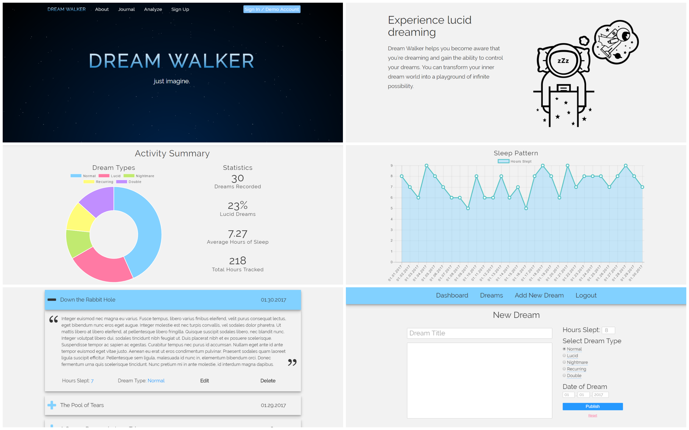
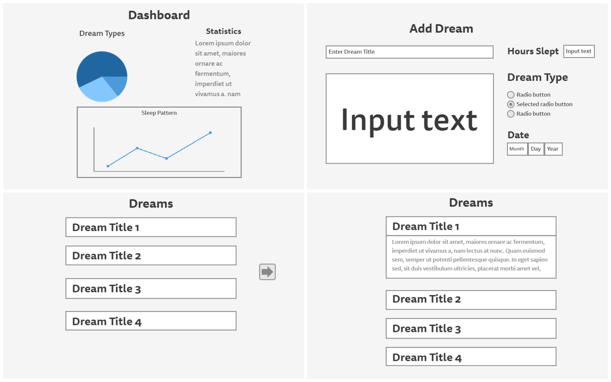

<h1>Dream Walker</h1>

Dream Walker is a responsive full-stack app that allows users to document their dreams and keep track of their sleeping patterns.

<h2>Introduction</h2>

The main focus of Dream Walker is to help users become lucid dreamers. A lucid dream is a dream during which the dreamer is aware of dreaming. During this event, the dreamer may be able to exert some degree of control over the characters, narrative, and environment.

<h2>How it Works</h2>
<h3>Record dreams</h3>

The key to lucid dreaming is to consistently document one's dreams so that patterns are easily recognized while dreaming. Dream Walker provides users with a quick and simple interface that helps them keep track of what they're dreaming about.

<h3>Keep track of progress</h3>

Users also have access to interactive charts and personalized statistics to help them measure their progress.

<h2>Wireframes</h2>

Initial wireframes were created for each page. Mockups of all key processes were designed with user flow in mind.

To keep distraction and confusion to a minimum, a simple and clean UI was implemented with smooth scrolling and fading transitions.

<h2>Technology</h2>
<ul>
  <li>This full-stack app was built using HTML5, </li>
</ul>
